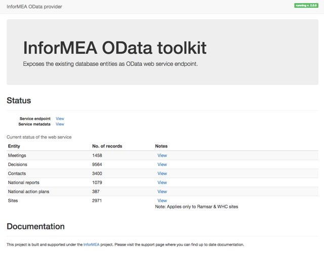

# Toolkit installation manual

The InforMEA toolkit is a Java J2EE application able to run by a servlet container such as Apache Tomcat, Jetty etc.

## Prerequisites checklist

 * Oracle JDK 1.7 latest
 * Apache Tomcat latest
 * (Optional) Apache Tomcat APR production library


## Install the web application archive (WAR)

  * Download the distribution (or alternatively build it from source code)
  * Copy and deploy the war in $TOMCAT_HOME/webapps
  * Configure database connection parameters located in $TOMCAT_HOME/webapps/informea/WEB-INF/classes/persistence.xml
  ```
  		<property name="javax.persistence.jdbc.url" value="jdbc:mysql://localhost/informea_odata?zeroDateTimeBehavior=convertToNull" />
  		<property name="javax.persistence.jdbc.user" value="root" />
        <property name="javax.persistence.jdbc.password" value="root" />
        <property name="eclipselink.connection-pool.default.url" value="jdbc:mysql://localhost/informea_odata?zeroDateTimeBehavior=convertToNull" />
  ```


## Configure database views required for toolkit to extract the data from your database

  In order to provide a generic structure across multiple installation, the InforMEA toolkit is using database views built on top of the underlying tables. The views have a known structure which is mapped as JPA entities and used to do read-only queries to extract the data and expose it as OData.

Examples of implemented views can be found in the repository under _doc/examples/*.sql_ and also in _src/test/sql/*.sql_ files.

The structure of the database views is used to export all entities described in the InforMEA OData specification document available [here](http://www.informea.org/api):

* Meetings
* Contacts
* Decisions
* Country reports
* National action plans
* Sites (sites are available *only* for WHC and Ramsar conventions)


Each entity exposed through the OData protocol is defined by a set of attributes. Some of these attributes are required, some of them are optional. Take for example a _Contact_ which has attributes such as first__name_, last__name_, address, email etc. All the entities and their attributes are defined by the InforMEA API document mentioned above.

We describe below each entity and their properties that must be exposed

### Meetings

To fully describe a meeting entity, 3 database views are required:

* informea_meetings
* informea_meetings_description
* informea_meetings_title

### Contacts

To fully describe a contact entity, 2 database views are required:

* informea_contacts
* informea_contacts_treaties

### Decisions

To fully describe a decision entity, 7 database views are required:

* informea_decisions
* informea_decisions_content
* informea_decisions_documents
* informea_decisions_keywords
* informea_decisions_longtitle
* informea_decisions_summary
* informea_decisions_title

### Country reports

To fully describe a country report entity, 2 database views are required:

* informea_country_reports
* informea_country_reports_title

### National Plans

To fully describe a national plan entity, 2 database views are required:

* informea_national_plans
* informea_national_plans_title

### Sites

To fully describe a site entity, two database views are required:

* informea_sites
* informea_sites_name


## Notes and other recommendations

* If you have the production database called `www_production`, you can create another one called `www_production_odata` which contains the views. This means that the views do not need to reside within the same database with other tables, but they sit in a different database. It's easier to manage and to update. This means that all the views definition statement must contain SELECTs prefixed with the databases. Examples:

	```SQL
	CREATE VIEW AS
	  SELECT * FROM `www_production`.`my_table` ...
	```

* It is advisable to create a reado-only user with SELECT privilege when configuring the toolkit


## Running the toolkit

After you configure the toolkit, you can access the overview page which would look like the image below:


